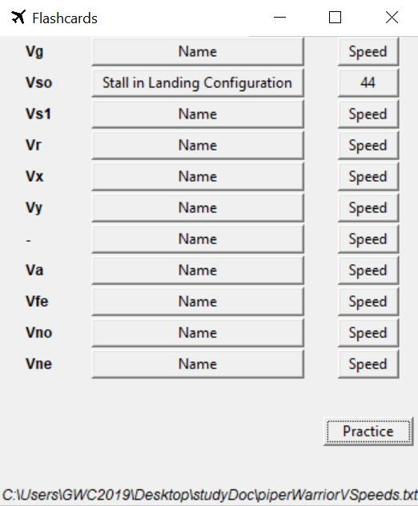
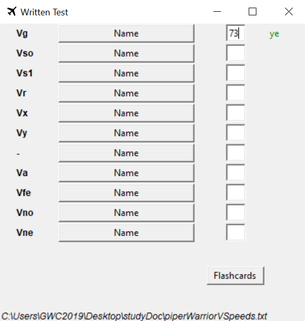

# StudyDoc
Tkinter GUI study source: "flashcards" and written practice for Piper Warrior II V-Speeds.

## Preview:
#### 1. Run study-guide.py
- Click the 'Name' Button to review the full name of the V-Speed.
- Click the 'Speed' Button to see the term definition in knots.
#### 2. Click 'Practice' Button
- Type in the definition of the corresponding term. Press enter.
-
-

## Methods Per Class:
- ### **__init__(self, master)**
  In both classes, this method is used to initialize widgets according to the source file's data, configure widget/frame functionality, and push the widgets to the Frame.

- ### **windowShift(self)**
  Closes current frame, initializes and configures new Toplevel frame, declares other class.
 
 
## "Global" Methods:
- ### **changeButtonText(x, set, type)**
  Changes button text on click to reveal answer dependent on file data, button type. Reads in a set of all of the buttons of the class.

- ### **abbrLabelsBuildPush(master)**
  Initiziales Label widgets of all terms/questions from input textfile. Pushes each Label to the Frame.
  
- ### **fnButtonsBuildPush(master)**
  Creates a set of Button widgets that represent the extended names of all terms/questions. Configures each to the changeButtonText() command. Pushes each Button to the Frame.
  
- ### **enterEntry(master, input, x)**
  Used in the WrittenTest class for type Entry widgets. On '<Return>' command (user presses "Enter" key), compares input to file data definition, pushes a Label widget to the Frame that answers correct vs. incorrect.
